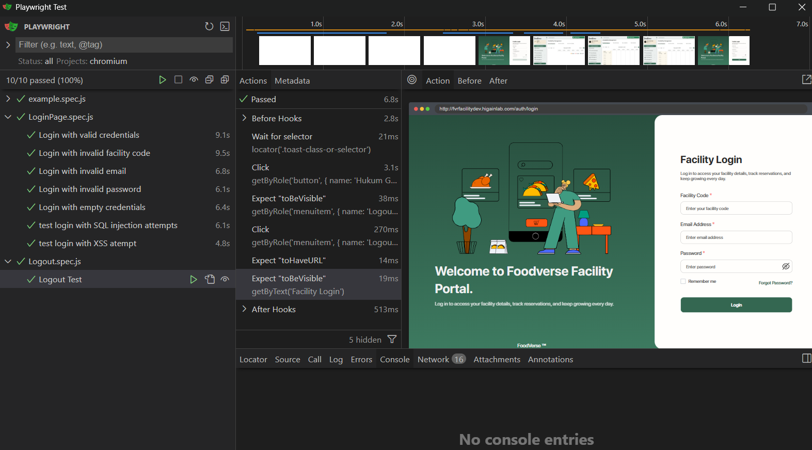
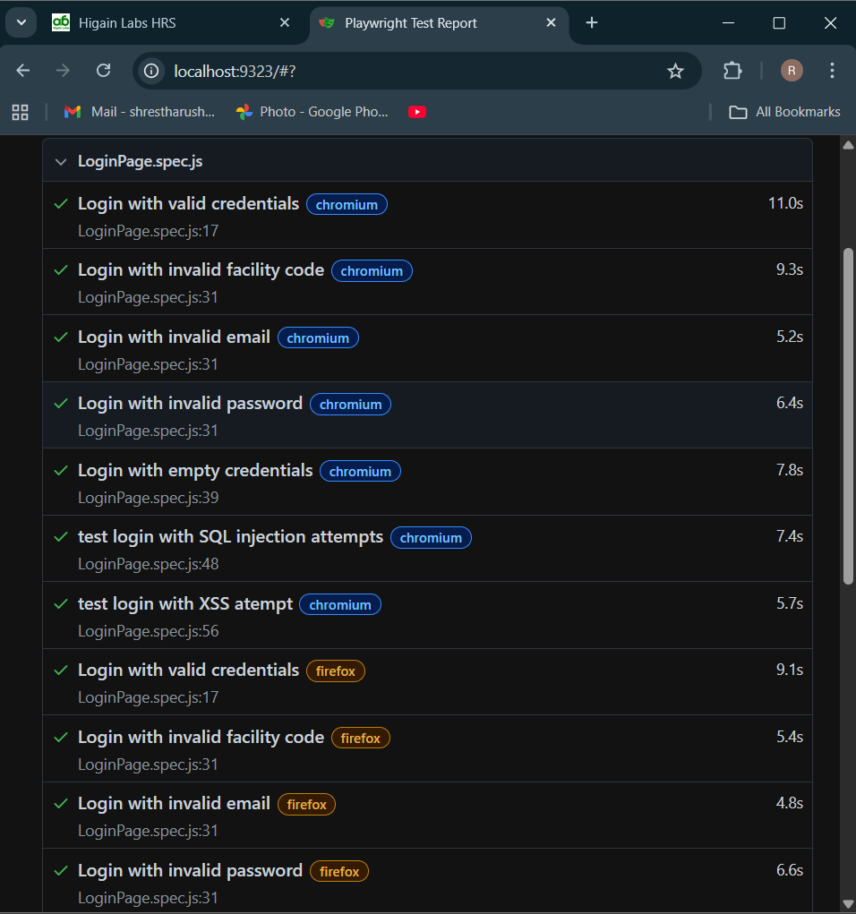

# Login Automation Using Playwright
## Overview
This repository contains automated test scripts for validating the login and logout functionality of the **FoodVerse** using Playwright. The tests ensure authentication workflows work correctly with various scenarios.
## Project Structure
```
tests/
├── fixtures/         → Test data
│   └── testData.js
│   ├── LoginPage.js
├── pages/            → Page Objects      
│   └── LogoutPage.js
├── LoginPage.spec.js → Tests using Page Objects
└── Logout.spec.js
playwright.config.js
README.md
```

## Getting Started
### **Prerequisites**
- Node.js 16+ installed
- npm package manager
### **Installation**
```

```bash
# Clone the repository (if applicable)
git clone [repository-url]
cd [project-directory]

# Install dependencies
npm install

# Install Playwright browsers
npx playwright install
```


## Running the Tests
1. Install Playwright\
   npm install @playwright/test
2. Run all tests\
   npx playwright test
3. Run specific file\
   npx playwright test tests/login.spec.js
4. Run tests in UI mode\
   npx playwright test --ui
5. Run tests with specific browser\
   npx playwright test --project=chromium

## Viewing Reports
1. View HTML Report\
   npx playwright show-report
2. Generate test report in CI format\
   npx playwright test --reporter=html

## Test Scenarios Covered
1. Login Tests
   * Login with valid credentials
   * Login with invalid facility code
   * Login with invalid email
   * Login with invalid password
   * Login with empty inputs
   * Login with SQL injection attempts
   * Login with XSS attempts
2. Logout Tests
   * Successful logout after logging in
## Page Object Model (POM)
This project follows the POM design pattern for maintainable and scalable test automation. POM helps by:
* Separating test logic from page interactions
* Centralizing selectors in one place
* Reducing code duplication across tests
* Making tests more readable and easier to update

## Page Explanation (LoginPage, LogoutPage)
1. LoginPage.js handles:
   * Navigating to login page
   * Filling valid/invalid credentials
   * SQL injection/XSS scenarios
   * Assertions for error messages and toast notifications
2. LogoutPage.js
   * Opening profile menu
   * Clicking logout
   * Validating logout success
## Report and Debugging
Playwright generates reports inside **playwright-report/** which can be opened with **npx playwright show-report**.
## Documentation & Screenshots

### **1. Test Execution**


### **2. HTML Report**



